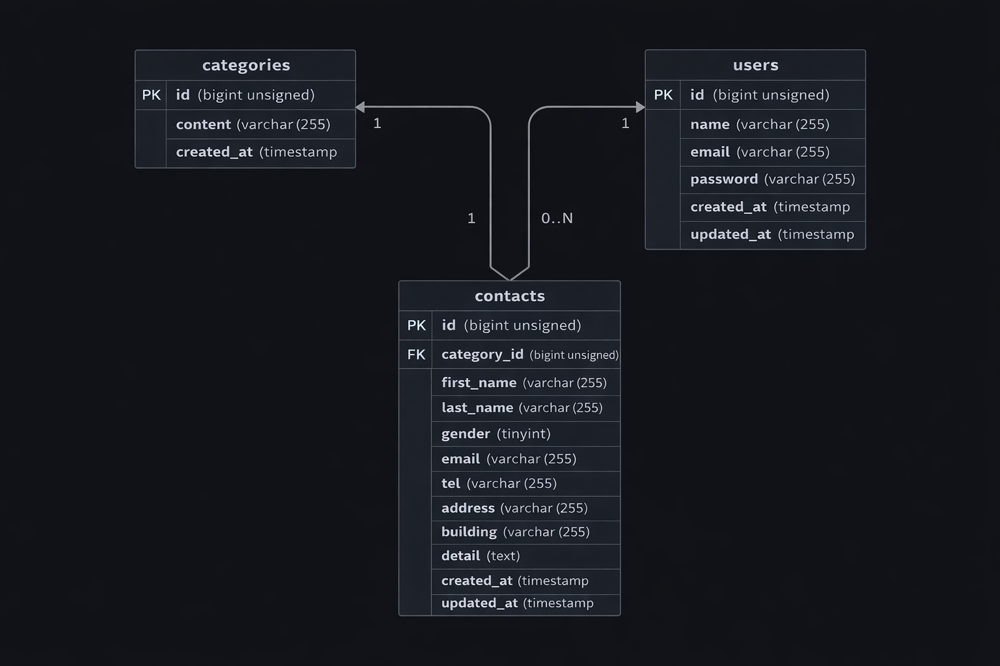

# お問い合わせフォーム

## 概要

お問い合わせを送信できるフォームアプリケーションです。
ユーザーはお問い合わせ内容を入力・送信でき、管理者は管理画面からお問い合わせ内容を確認することができます。

---

## 環境構築

### Dockerビルド

```bash
git clone git@github.com:yasuyasuikeikb-collab/contact-app.git
cd contact-app
docker-compose up -d --build
```

---

### Laravel環境構築

```bash
docker-compose exec php bash
cd /var/www

composer install
cp .env.example .env
php artisan key:generate
php artisan migrate
# 必要に応じて
php artisan db:seed
```

---

## 開発環境

* お問い合わせ画面：http://localhost
* 管理画面：http://localhost/admin
* phpMyAdmin：http://localhost:8080

---

## 使用技術（実行環境）

* PHP 8.x
* Laravel 8.x
* MySQL 8.0.26
* nginx 1.21.1
* Docker / Docker Compose

---

## ER図



---

## URL

* 開発環境：http://localhost

---

## 動作確認方法

1. トップページにアクセス
2. お問い合わせフォームに入力
3. 送信ボタンを押下
4. 管理画面にてデータが保存されていることを確認

---

## 注意事項

* Dockerがインストールされている必要があります
* ポート80が使用されている場合は変更してください
* 初回起動時はcomposer installに時間がかかる場合があります
